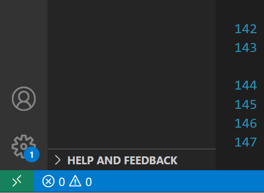

# **CS Lab Machines:**
## **A No-Bull**SSH**it Guide**
### William & Mary ACM

#### 9/28/2023

---

# **Road Map**

1. **A**nnoun**C**e**M**ents! (~7:05)
1. Department Machine Workshop (~7:10)
2. The Wiki Game (~7:40)

---

# **Special Election!**

#### We will be electing the following positions next meeting!

TIP Chair 🧮
Cypher Chairs (2) 🦀🦀

**Sign up to nominate yourself or someone else right here -->**

---

# **Roots & Nodes** (Bigs & Littles)

* A designated friend in ACM and in the tech community on campus!
* Someone to look up to or share knowledge with about
    * Your CS/DS classes
    * Career goals
    * Tech things you like!
    * Life in general!
* First time ACM has done this since COVID!

---

# **How do I get one?**

* Root & node matching activities will happen **next meeting: October 5th** after the special election!
* Root & node reveals will happen the subsequent meeting, **October 12th**!
* Between the two meetings, roots will find out who their nodes are and will give them a series of clues ahead of the reveal!
* More specific details to come on Discord/in the newsletter about how this will happen!

---

### **Global Hack Week: Open Source!** (From ACM.org)

Every month Major League Hacking (MLH) hosts Global Hack Week where you can learn new skills, build your portfolio, attend fun sessions, and connect with other hackers from around the world. 

Join them for their next event, Global Hack Week: Open Source, taking place **October 16th - 23rd**. Join a community of 3,000 developers from around the world in **demystifying open source** while leveling up your technical skill and earning swag along the way!

Will drop the link to register in our Discord!

---

# **Your PC vs the lab machines**

---

# **Why use the lab machines?**

* Linux is fun and useful
* Machine Learning! Graphics!
* Make sure your code works the same when you write it and when it is graded *(especially in 303 and 304)*
* Does your PC sound like a jet engine?

---

# **Where are they located?**

* McGlothlin Street Hall! (Chances are you are there right now 👀)
* Two types - McStreet 121 machines and the BGs
* All of them have different parts:

https://support.cs.wm.edu/index.php/specs

---

# **Hacking into the server room** (with permission from Joe Hause)

* Get a CS Department Account from
* Open PowerShell
* `ssh <your-username>@<lab-machine>.cs.wm.edu`
* Type in your password
    * This is really annoying
    * You can't see how many letters you've typed
* You're in!

---

# **A better way**

* VSCode can do everything (pay your tuition, create world peace, bring meal swipes back to marketplace)
* Download it at https://code.visualstudio.com
* Download the **Remote Development Extension Pack** (or just the Remote - SSH extension)

---

# **Choose your target**

Once you have the extension installed, you can access the remote menu from the sidebar!

Click the + button and type the connection command 

---

# **Click the little green thing**

* It kinda hides there
* It's at the bottom left corner
* Click it and click "Connect to host"

---

# **Connecting with the extension**

* It will ask you for your password
* It will ask you to confirm a random fingerprint, you kind of just have to say yes and trust it
* The first time it will take a while to connect

---

# **Welcome home!**

* You can now access your home directory on the department computer with a file explorer!
* You can run linux commands in the VSCode terminal (I promise it won't bite)
* You can drag & drop files from your file explorer or use the upload/download options (much easier than SFTP)

---

# **More:** Create a SSH Key!

You can use the `ssh-keygen` command to create a public and private key pair so you can stay logged in without a password! (Only on a trusted computer!)

https://kb.iu.edu/d/aews

---

# **More:** HuggingFace!

Have you ever wanted to run a large language model or another machine learning model without worrying if your data is being messed with?

**Lots of machine learning models to try:** https://huggingface.co/

Many of these models require a GPU with a lot of VRAM-- thankfully, we have those!

---

# **More:** GPU Programming!

Are you interested in lower level programming? Enjoyed CS304?

Learn how to write your very own RayTracer in C++, then extend it to run more than 10x faster on the GPU!

https://developer.nvidia.com/blog/accelerated-ray-tracing-cuda/

---

# **The Wiki Game!**

Go here:
## https://wiki-race.com/

Jackson will reveal the lobby code.

Tournament??